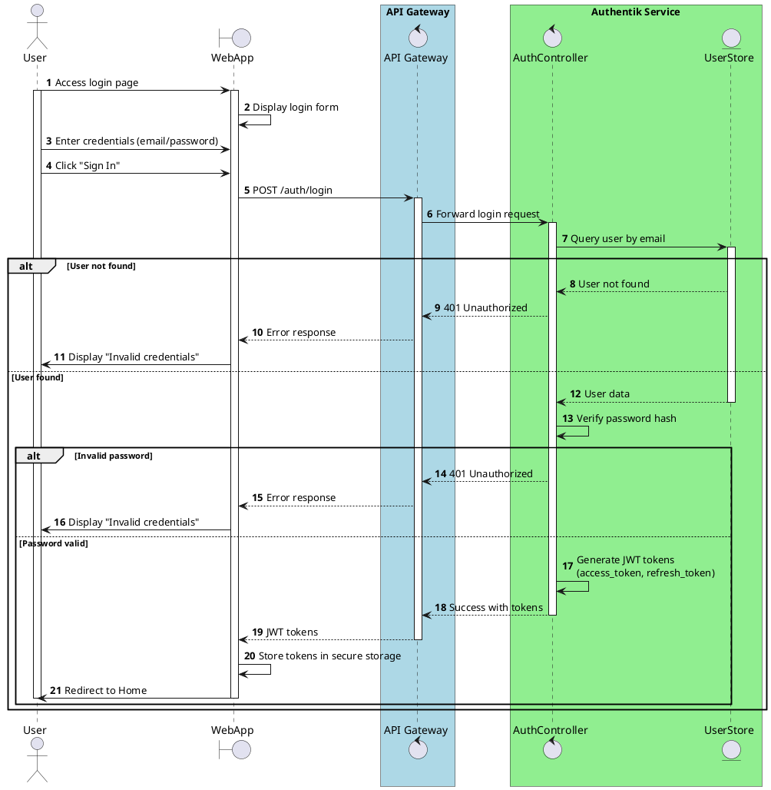

# Sequence Login

:::info
Người dùng đăng nhập vào hệ thống qua Authentik.
:::

```plantuml
@startuml
autonumber

skinparam BoxPadding 10

actor User as U
boundary WebApp as WA

box "API Gateway" #LightBlue
  control "API Gateway" as GW
end box

box "Authentik Service" #LightGreen
  control AuthController as AC
  entity UserStore as US
end box

U -> WA: Access login page
activate U
activate WA
WA -> WA: Display login form

U -> WA: Enter credentials (email/password)
U -> WA: Click "Sign In"

WA -> GW: POST /auth/login
activate GW
GW -> AC: Forward login request
activate AC

AC -> US: Query user by email
activate US

alt User not found
  AC <-- US: User not found
  GW <-- AC: 401 Unauthorized
  WA <-- GW: Error response
  WA -> U: Display "Invalid credentials"
else User found
  AC <-- US: User data
  deactivate US

  AC -> AC: Verify password hash

  alt Invalid password
    GW <-- AC: 401 Unauthorized
    WA <-- GW: Error response
    WA -> U: Display "Invalid credentials"
  else Password valid
    AC -> AC: Generate JWT tokens\n(access_token, refresh_token)
    GW <-- AC: Success with tokens
    deactivate AC
    WA <-- GW: JWT tokens
    deactivate GW
    WA -> WA: Store tokens in secure storage
    WA -> U: Redirect to Home
    deactivate WA
    deactivate U
  end
end

@enduml
```

<!-- diagram id="sequence-egolia-user-login" -->
