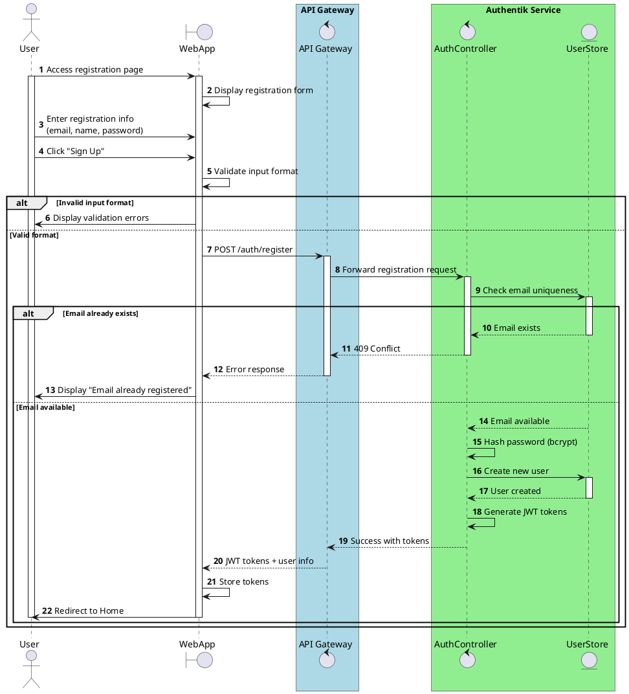

# Sequence Register

:::info
Người dùng mới đăng ký tài khoản qua Authentik.
:::

```plantuml
@startuml
autonumber

skinparam BoxPadding 10

actor User as U
boundary WebApp as WA

box "API Gateway" #LightBlue
  control "API Gateway" as GW
end box

box "Authentik Service" #LightGreen
  control AuthController as AC
  entity UserStore as US
end box

U -> WA: Access registration page
activate U
activate WA
WA -> WA: Display registration form

U -> WA: Enter registration info\n(email, name, password)
U -> WA: Click "Sign Up"

WA -> WA: Validate input format

alt Invalid input format
  WA -> U: Display validation errors
else Valid format
  WA -> GW: POST /auth/register
  activate GW
  GW -> AC: Forward registration request
  activate AC

  AC -> US: Check email uniqueness
  activate US

  alt Email already exists
    AC <-- US: Email exists
    deactivate US
    GW <-- AC: 409 Conflict
    deactivate AC
    WA <-- GW: Error response
    deactivate GW
    WA -> U: Display "Email already registered"
  else Email available
    AC <-- US: Email available
    deactivate US
    AC -> AC: Hash password (bcrypt)
    AC -> US: Create new user
    activate US
    AC <-- US: User created
    deactivate US
    AC -> AC: Generate JWT tokens
    GW <-- AC: Success with tokens
    deactivate AC
    WA <-- GW: JWT tokens + user info
    deactivate GW
    WA -> WA: Store tokens
    WA -> U: Redirect to Home
    deactivate WA
    deactivate U
  end
end

@enduml
```

<!-- diagram id="sequence-egolia-user-register" -->
