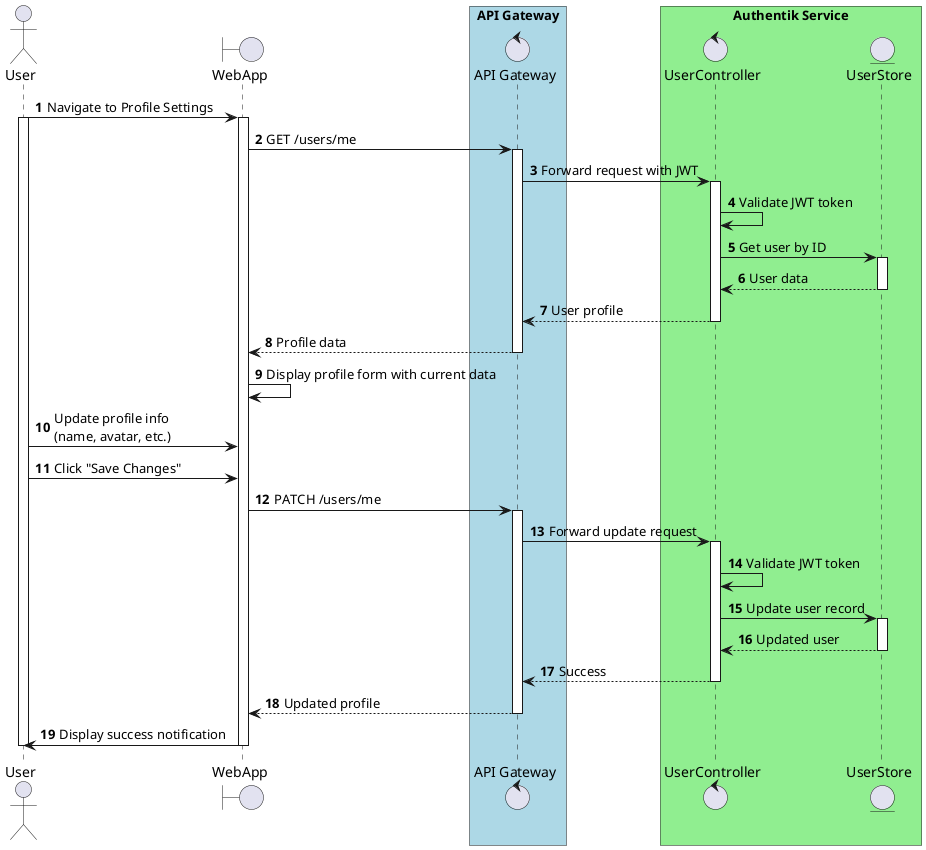

# Sequence Update Profile

:::info
Người dùng cập nhật thông tin hồ sơ cá nhân.
:::

```plantuml
@startuml
autonumber

skinparam BoxPadding 10

actor User as U
boundary WebApp as WA

box "API Gateway" #LightBlue
  control "API Gateway" as GW
end box

box "Authentik Service" #LightGreen
  control UserController as UC
  entity UserStore as US
end box

U -> WA: Navigate to Profile Settings
activate U
activate WA

WA -> GW: GET /users/me
activate GW
GW -> UC: Forward request with JWT
activate UC
UC -> UC: Validate JWT token

UC -> US: Get user by ID
activate US
UC <-- US: User data
deactivate US

GW <-- UC: User profile
deactivate UC
WA <-- GW: Profile data
deactivate GW

WA -> WA: Display profile form with current data

U -> WA: Update profile info\n(name, avatar, etc.)
U -> WA: Click "Save Changes"

WA -> GW: PATCH /users/me
activate GW
GW -> UC: Forward update request
activate UC
UC -> UC: Validate JWT token

UC -> US: Update user record
activate US
UC <-- US: Updated user
deactivate US

GW <-- UC: Success
deactivate UC
WA <-- GW: Updated profile
deactivate GW

WA -> U: Display success notification
deactivate WA
deactivate U

@enduml
```

<!-- diagram id="sequence-egolia-user-update-profile" -->
