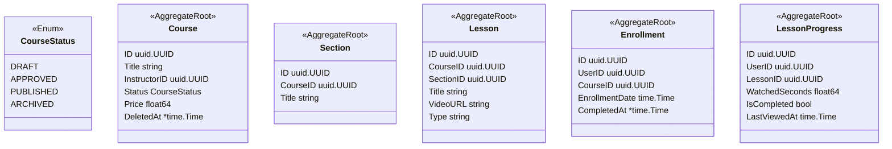
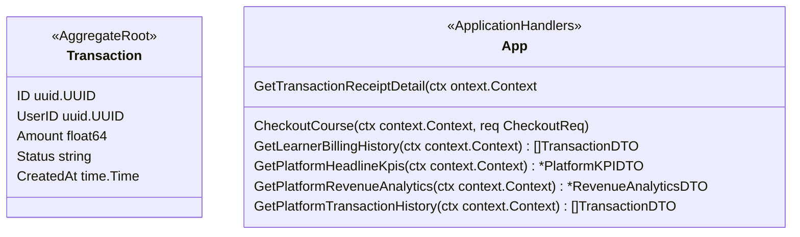
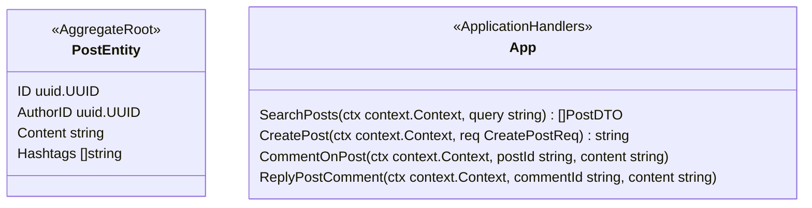

# Class Diagram

:::info

- Golang syntax
- Apply DDD, CQRS, repository pattern

:::

## Course

```mermaid
classDiagram
    class CourseStatus {
        <<Enum>>
        DRAFT
        APPROVED
        PUBLISHED
        ARCHIVED
    }

    class Course {
        <<AggregateRoot>>
        ID uuid.UUID
        Title string
        InstructorID uuid.UUID
        Status CourseStatus
        Price float64
        DeletedAt *time.Time
    }

    class Section {
        <<AggregateRoot>>
        ID uuid.UUID
        CourseID uuid.UUID
        Title string
    }

    class Lesson {
        <<AggregateRoot>>
        ID uuid.UUID
        CourseID uuid.UUID
        SectionID uuid.UUID
        Title string
        VideoURL string
        Type string
    }

    class Enrollment {
        <<AggregateRoot>>
        ID uuid.UUID
        UserID uuid.UUID
        CourseID uuid.UUID
        EnrollmentDate time.Time
        CompletedAt *time.Time
    }

    class LessonProgress {
        <<AggregateRoot>>
        ID uuid.UUID
        UserID uuid.UUID
        LessonID uuid.UUID
        WatchedSeconds float64
        IsCompleted bool
        LastViewedAt time.Time
    }
```

## Billing

```mermaid
classDiagram
    class Transaction {
        <<AggregateRoot>>
        ID uuid.UUID
        UserID uuid.UUID
        Amount float64
        Status string
        CreatedAt time.Time
    }

    class App {
        <<ApplicationHandlers>>
        CheckoutCourse(ctx context.Context, req CheckoutReq)
        GetLearnerBillingHistory(ctx context.Context) []TransactionDTO
        GetTransactionReceiptDetail(ctx ontext.Context
        GetPlatformHeadlineKpis(ctx context.Context) *PlatformKPIDTO
        GetPlatformRevenueAnalytics(ctx context.Context) *RevenueAnalyticsDTO
        GetPlatformTransactionHistory(ctx context.Context) []TransactionDTO
    }
```

## Blog

```mermaid
classDiagram
    class PostEntity {
        <<AggregateRoot>>
        ID uuid.UUID
        AuthorID uuid.UUID
        Content string
        Hashtags []string
    }

    class App {
        <<ApplicationHandlers>>
        SearchPosts(ctx context.Context, query string) []PostDTO
        CreatePost(ctx context.Context, req CreatePostReq) string
        CommentOnPost(ctx context.Context, postId string, content string)
        ReplyPostComment(ctx context.Context, commentId string, content string)
    }
```

<!-- vim:set tabstop=4 shiftwidth=4: -->
