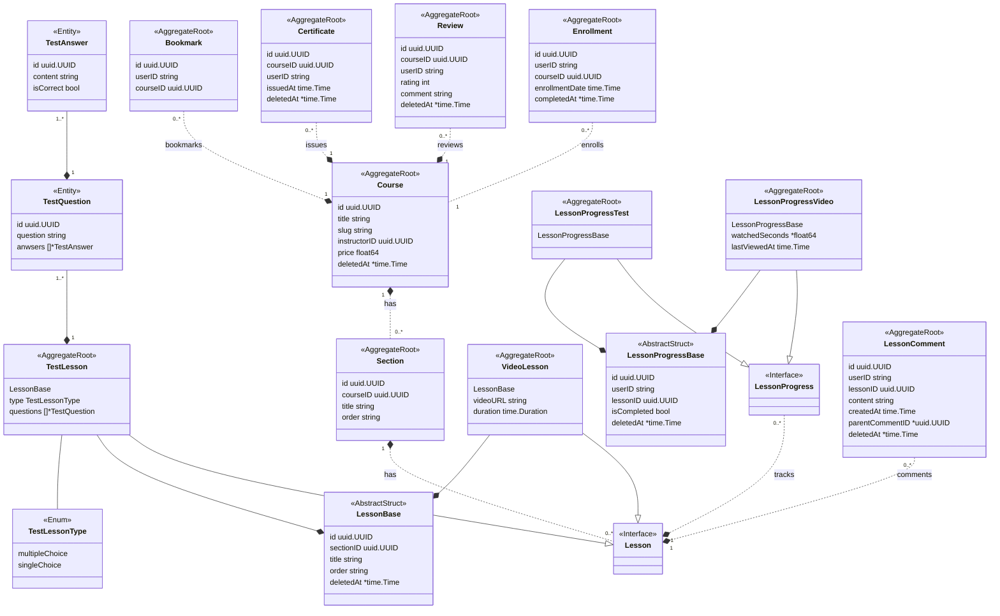
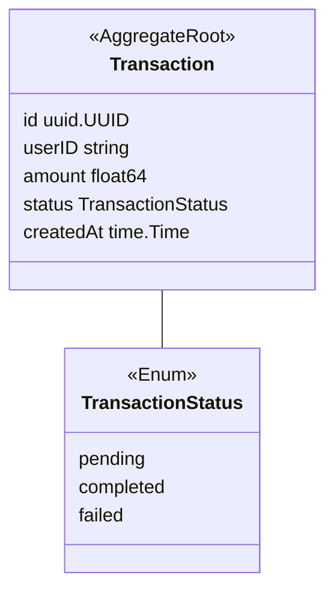
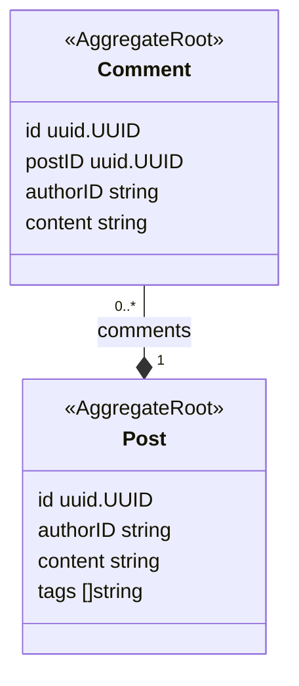

# Class Diagram

:::info

- Golang syntax
- Apply DDD, Clean architecture

:::

## Course

```mermaid
classDiagram
    %% class CourseStatus {
    %%     <<Enum>>
    %%     draft
    %%     approved
    %%     published
    %%     archived
    %% }

    class Course {
        <<AggregateRoot>>
        id uuid.UUID
        title string
        slug string
        instructorID uuid.UUID
        %% status CourseStatus
        price float64
        deletedAt *time.Time
    }

    class Section {
        <<AggregateRoot>>
        id uuid.UUID
        courseID uuid.UUID
        title string
        order string
    }

    class Lesson {
        <<Interface>>
    }

    class LessonBase {
        <<AbstractStruct>>
        id uuid.UUID
        sectionID uuid.UUID
        title string
        order string
        deletedAt *time.Time
    }

    class TestLessonType {
        <<Enum>>
        multipleChoice
        singleChoice
    }

    class TestLesson {
        <<AggregateRoot>>
        LessonBase
        type TestLessonType
        questions []*TestQuestion
    }

    class TestQuestion {
        <<Entity>>
        id uuid.UUID
        question string
        anwsers []*TestAnswer
    }

    class TestAnswer {
        <<Entity>>
        id uuid.UUID
        content string
        isCorrect bool
    }

    class VideoLesson {
        <<AggregateRoot>>
        LessonBase
        videoURL string
        duration time.Duration
    }

    class Enrollment {
        <<AggregateRoot>>
        id uuid.UUID
        userID string
        courseID uuid.UUID
        enrollmentDate time.Time
        completedAt *time.Time
    }

    class LessonProgress {
        <<Interface>>
    }

    class LessonProgressBase {
        <<AbstractStruct>>
        id uuid.UUID
        userID string
        lessonID uuid.UUID
        isCompleted bool
        deletedAt *time.Time
    }

    class LessonProgressTest {
        <<AggregateRoot>>
        LessonProgressBase
    }

    class LessonProgressVideo {
        <<AggregateRoot>>
        LessonProgressBase
        watchedSeconds *float64
        lastViewedAt time.Time
    }

    class LessonComment {
        <<AggregateRoot>>
        id uuid.UUID
        userID string
        lessonID uuid.UUID
        content string
        createdAt time.Time
        parentCommentID *uuid.UUID
        deletedAt *time.Time
    }

    class Review {
        <<AggregateRoot>>
        id uuid.UUID
        courseID uuid.UUID
        userID string
        rating int
        comment string
        deletedAt *time.Time
    }

    class Certificate {
        <<AggregateRoot>>
        id uuid.UUID
        courseID uuid.UUID
        userID string
        issuedAt time.Time
        deletedAt *time.Time
    }

    class Bookmark {
        <<AggregateRoot>>
        id uuid.UUID
        userID string
        courseID uuid.UUID
    }

    Course "1" *.. "0..*" Section : has
    Section "1" *.. "0..*" Lesson : has
    TestLesson --|> Lesson
    VideoLesson --|> Lesson
    TestLesson --* LessonBase
    VideoLesson --* LessonBase
    TestLesson -- TestLessonType
    TestQuestion "1..*" --* "1" TestLesson
    TestAnswer "1..*" --* "1" TestQuestion
    Enrollment "0..*" .. "1" Course : enrolls
    LessonProgressVideo --|> LessonProgress
    LessonProgressVideo --* LessonProgressBase
    LessonProgressTest --|> LessonProgress
    LessonProgressTest --* LessonProgressBase
    LessonProgress "0..*" ..* "1" Lesson : tracks
    Review "0..*" ..* "1" Course : reviews
    LessonComment "0..*" ..* "1" Lesson : comments
    Certificate "0..*" ..* "1" Course : issues
    Bookmark "0..*" ..* "1" Course : bookmarks
```

## Billing

```mermaid
classDiagram
    class TransactionStatus {
        <<Enum>>
        pending
        completed
        failed
    }

    class Transaction {
        <<AggregateRoot>>
        id uuid.UUID
        userID string
        amount float64
        status TransactionStatus
        createdAt time.Time
    }

    Transaction  -- TransactionStatus

    %% class App {
    %%     <<ApplicationHandlers>>
    %%     CheckoutCourse(ctx context.Context, req CheckoutReq)
    %%     GetLearnerBillingHistory(ctx context.Context) []TransactionDTO
    %%     GetTransactionReceiptDetail(ctx ontext.Context
    %%     GetPlatformHeadlineKpis(ctx context.Context) *PlatformKPIDTO
    %%     GetPlatformRevenueAnalytics(ctx context.Context) *RevenueAnalyticsDTO
    %%     GetPlatformTransactionHistory(ctx context.Context) []TransactionDTO
    %% }
```

## Blog

```mermaid
classDiagram
    class Post {
        <<AggregateRoot>>
        id uuid.UUID
        authorID string
        content string
        tags []string
    }

    class Comment {
        <<AggregateRoot>>
        id uuid.UUID
        postID uuid.UUID
        authorID string
        content string
    }

    Comment "0..*" --* "1" Post : comments

    %% class App {
    %%     <<ApplicationHandlers>>
    %%     SearchPosts(ctx context.Context, query string) []PostDTO
    %%     CreatePost(ctx context.Context, req CreatePostReq) string
    %%     CommentOnPost(ctx context.Context, postId string, content string)
    %%     ReplyPostComment(ctx context.Context, commentId string, content string)
    %% }
```

<!-- vim:set tabstop=4 shiftwidth=4: -->
