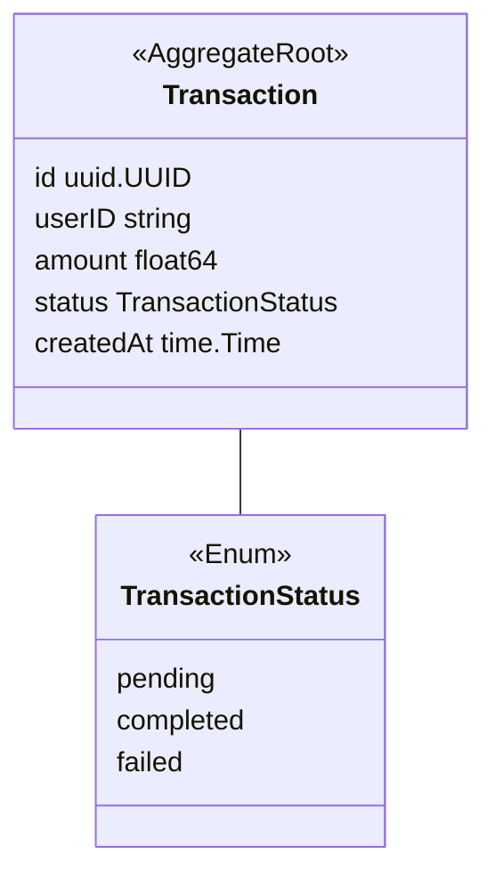

# Billing

```mermaid
classDiagram
    class TransactionStatus {
        <<Enum>>
        pending
        completed
        failed
    }

    class Transaction {
        <<AggregateRoot>>
        id uuid.UUID
        userID string
        amount float64
        status TransactionStatus
        createdAt time.Time
    }

    Transaction  -- TransactionStatus

    %% class App {
    %%     <<ApplicationHandlers>>
    %%     CheckoutCourse(ctx context.Context, req CheckoutReq)
    %%     GetLearnerBillingHistory(ctx context.Context) []TransactionDTO
    %%     GetTransactionReceiptDetail(ctx ontext.Context
    %%     GetPlatformHeadlineKpis(ctx context.Context) *PlatformKPIDTO
    %%     GetPlatformRevenueAnalytics(ctx context.Context) *RevenueAnalyticsDTO
    %%     GetPlatformTransactionHistory(ctx context.Context) []TransactionDTO
    %% }
```

<!-- vim:set tabstop=4 shiftwidth=4: -->
