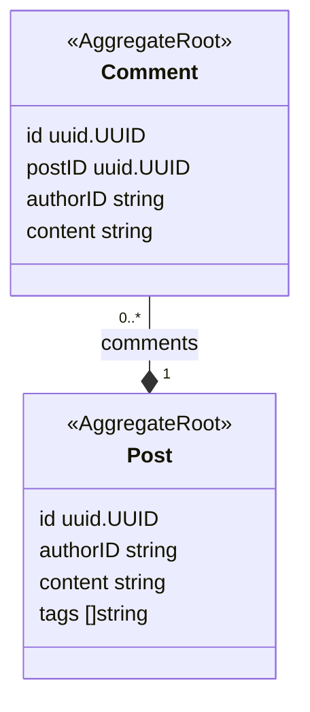

# Blog

```mermaid
classDiagram
    class Post {
        <<AggregateRoot>>
        id uuid.UUID
        authorID string
        content string
        tags []string
    }

    class Comment {
        <<AggregateRoot>>
        id uuid.UUID
        postID uuid.UUID
        authorID string
        content string
    }

    Comment "0..*" --* "1" Post : comments

    %% class App {
    %%     <<ApplicationHandlers>>
    %%     SearchPosts(ctx context.Context, query string) []PostDTO
    %%     CreatePost(ctx context.Context, req CreatePostReq) string
    %%     CommentOnPost(ctx context.Context, postId string, content string)
    %%     ReplyPostComment(ctx context.Context, commentId string, content string)
    %% }
```

<!-- vim:set tabstop=4 shiftwidth=4: -->
