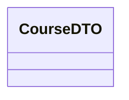
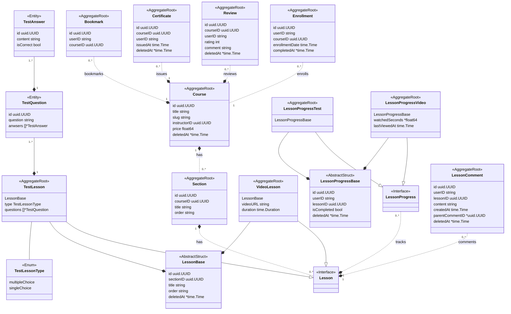
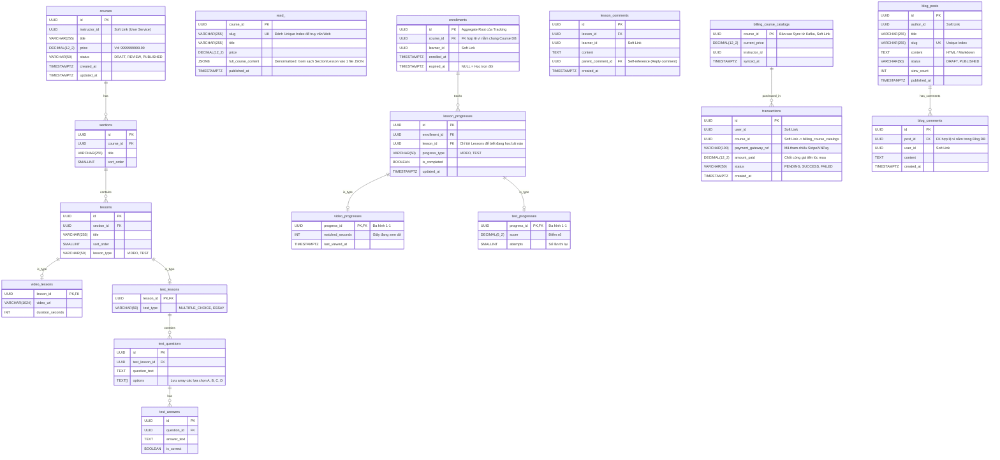

# Course

:::info

- Golang syntax
- Apply DDD, Clean architecture

:::

## App Model

```mermaid
classDiagram
    class CourseDTO {
    }
```

## Domain Model

```mermaid
classDiagram
    %% class CourseStatus {
    %%     <<Enum>>
    %%     draft
    %%     approved
    %%     published
    %%     archived
    %% }

    class Course {
        <<AggregateRoot>>
        id uuid.UUID
        title string
        slug string
        instructorID uuid.UUID
        %% status CourseStatus
        price float64
        deletedAt *time.Time
    }

    class Section {
        <<AggregateRoot>>
        id uuid.UUID
        courseID uuid.UUID
        title string
        order string
    }

    class Lesson {
        <<Interface>>
    }

    class LessonBase {
        <<AbstractStruct>>
        id uuid.UUID
        sectionID uuid.UUID
        title string
        order string
        deletedAt *time.Time
    }

    class TestLessonType {
        <<Enum>>
        multipleChoice
        singleChoice
    }

    class TestLesson {
        <<AggregateRoot>>
        LessonBase
        type TestLessonType
        questions []*TestQuestion
    }

    class TestQuestion {
        <<Entity>>
        id uuid.UUID
        question string
        anwsers []*TestAnswer
    }

    class TestAnswer {
        <<Entity>>
        id uuid.UUID
        content string
        isCorrect bool
    }

    class VideoLesson {
        <<AggregateRoot>>
        LessonBase
        videoURL string
        duration time.Duration
    }

    class Enrollment {
        <<AggregateRoot>>
        id uuid.UUID
        userID string
        courseID uuid.UUID
        enrollmentDate time.Time
        completedAt *time.Time
    }

    class LessonProgress {
        <<Interface>>
    }

    class LessonProgressBase {
        <<AbstractStruct>>
        id uuid.UUID
        userID string
        lessonID uuid.UUID
        isCompleted bool
        deletedAt *time.Time
    }

    class LessonProgressTest {
        <<AggregateRoot>>
        LessonProgressBase
    }

    class LessonProgressVideo {
        <<AggregateRoot>>
        LessonProgressBase
        watchedSeconds *float64
        lastViewedAt time.Time
    }

    class LessonComment {
        <<AggregateRoot>>
        id uuid.UUID
        userID string
        lessonID uuid.UUID
        content string
        createdAt time.Time
        parentCommentID *uuid.UUID
        deletedAt *time.Time
    }

    class Review {
        <<AggregateRoot>>
        id uuid.UUID
        courseID uuid.UUID
        userID string
        rating int
        comment string
        deletedAt *time.Time
    }

    class Certificate {
        <<AggregateRoot>>
        id uuid.UUID
        courseID uuid.UUID
        userID string
        issuedAt time.Time
        deletedAt *time.Time
    }

    class Bookmark {
        <<AggregateRoot>>
        id uuid.UUID
        userID string
        courseID uuid.UUID
    }

    Course "1" *.. "0..*" Section : has
    Section "1" *.. "0..*" Lesson : has
    TestLesson --|> Lesson
    VideoLesson --|> Lesson
    TestLesson --* LessonBase
    VideoLesson --* LessonBase
    TestLesson -- TestLessonType
    TestQuestion "1..*" --* "1" TestLesson
    TestAnswer "1..*" --* "1" TestQuestion
    Enrollment "0..*" .. "1" Course : enrolls
    LessonProgressVideo --|> LessonProgress
    LessonProgressVideo --* LessonProgressBase
    LessonProgressTest --|> LessonProgress
    LessonProgressTest --* LessonProgressBase
    LessonProgress "0..*" ..* "1" Lesson : tracks
    Review "0..*" ..* "1" Course : reviews
    LessonComment "0..*" ..* "1" Lesson : comments
    Certificate "0..*" ..* "1" Course : issues
    Bookmark "0..*" ..* "1" Course : bookmarks
```

## Entity

```mermaid
classDiagram
    class Course {
        ID uuid.UUID [gorm:primaryKey]
        Title string [gorm:not_null]
        Slug string [gorm:uniqueIndex,not_null]
        InstructorID string [gorm:not_null,column:instructor_id]
        Price float64
        DeletedAt *time.Time [gorm:index]
        CreatedAt time.Time [gorm:autoCreateTime]
        UpdatedAt time.Time [gorm:autoUpdateTime]
    }

    class Section {
        ID uuid.UUID [gorm:primaryKey]
        CourseID uuid.UUID [gorm:not_null]
        Course *Course [gorm:foreignKey:CourseID]
        Title string [gorm:not_null]
        SortOrder integer [gorm:column:sort_order,not_null,default:0]
        CreatedAt time.Time [gorm:autoCreateTime]
        UpdatedAt time.Time [gorm:autoUpdateTime]
    }

    class LessonBase {
        ID uuid.UUID [gorm:primaryKey]
        SectionID uuid.UUID [gorm:not_null]
        Section *Section [gorm:foreignKey:SectionID]
        Title string [gorm:not_null]
        SortOrder integer [gorm:column:sort_order,not_null,default:0]
        DeletedAt *time.Time [gorm:index]
        CreatedAt time.Time [gorm:autoCreateTime]
        UpdatedAt time.Time [gorm:autoUpdateTime]
    }

    class TestLessonType {
        <<Enum>>
        multipleChoice
        singleChoice
    }

    class TestLesson {
        LessonBase [gorm:embedded]
        Type TestLessonType [gorm:not_null]
        Questions []*TestQuestion [gorm:foreignKey:LessonID]
    }

    class TestQuestion {
        ID uuid.UUID [gorm:primaryKey]
        LessonID uuid.UUID [gorm:not_null]
        Lesson *TestLesson [gorm:foreignKey:LessonID]
        Question string [gorm:type:text,not_null]
        Options []string [gorm:type:jsonb,not_null]
        Answers []*TestAnswer [gorm:foreignKey:QuestionID]
    }

    class TestAnswer {
        ID uuid.UUID [gorm:primaryKey]
        QuestionID uuid.UUID [gorm:not_null]
        Question *TestQuestion [gorm:foreignKey:QuestionID]
        Answer string [gorm:not_null]
        IsCorrect bool [gorm:default:false]
        CreatedAt time.Time [gorm:autoCreateTime]
    }

    class VideoLesson {
        LessonBase [gorm:embedded]
        VideoURL string [gorm:not_null]
        Duration time.Duration
    }

    class Enrollment {
        ID uuid.UUID [gorm:primaryKey]
        CourseID uuid.UUID [gorm:not_null]
        Course *Course [gorm:foreignKey:CourseID]
        UserID uuid.UUID [gorm:not_null]
        EnrollmentDate time.Time [gorm:autoCreateTime]
        CompletedAt *time.Time
        CreatedAt time.Time [gorm:autoCreateTime]
        UpdatedAt time.Time [gorm:autoUpdateTime]
    }

    class LessonProgressBase {
        ID uuid.UUID [gorm:primaryKey]
        UserID uuid.UUID [gorm:not_null]
        LessonID uuid.UUID [gorm:not_null]
        Lesson *LessonBase [gorm:foreignKey:LessonID]
        IsCompleted bool [gorm:default:false]
        DeletedAt *time.Time [gorm:index]
        CreatedAt time.Time [gorm:autoCreateTime]
        UpdatedAt time.Time [gorm:autoUpdateTime]
    }

    class LessonProgressTest {
        LessonProgressBase [gorm:embedded]
    }

    class LessonProgressVideo {
        LessonProgressBase [gorm:embedded]
        WatchedSeconds *float64
        LastViewedAt time.Time
    }

    class LessonComment {
        ID uuid.UUID [gorm:primaryKey]
        UserID uuid.UUID [gorm:not_null]
        LessonID uuid.UUID [gorm:not_null]
        Lesson *LessonBase [gorm:foreignKey:LessonID]
        Content string [gorm:type:text,not_null]
        CreatedAt time.Time [gorm:autoCreateTime]
        UpdatedAt time.Time [gorm:autoUpdateTime]
        ParentCommentID *uuid.UUID
        ParentComment *LessonComment [gorm:foreignKey:ParentCommentID]
        DeletedAt *time.Time [gorm:index]
    }

    class Review {
        ID uuid.UUID [gorm:primaryKey]
        CourseID uuid.UUID [gorm:not_null]
        Course *Course [gorm:foreignKey:CourseID]
        UserID uuid.UUID [gorm:not_null]
        Rating int [gorm:not_null]
        Comment string [gorm:type:text]
        CreatedAt time.Time [gorm:autoCreateTime]
        UpdatedAt time.Time [gorm:autoUpdateTime]
        DeletedAt *time.Time [gorm:index]
    }

    class Certificate {
        ID uuid.UUID [gorm:primaryKey]
        CourseID uuid.UUID [gorm:not_null]
        Course *Course [gorm:foreignKey:CourseID]
        UserID uuid.UUID [gorm:not_null]
        IssuedAt time.Time [gorm:autoCreateTime]
        CertificateURL string [gorm:column:certificate_url]
        DeletedAt *time.Time [gorm:index]
    }

    class Bookmark {
        ID uuid.UUID [gorm:primaryKey]
        UserID uuid.UUID [gorm:not_null]
        CourseID uuid.UUID [gorm:not_null]
        Course *Course [gorm:foreignKey:CourseID]
        CreatedAt time.Time [gorm:autoCreateTime]
    }

    class TransactionStatus {
        <<Enum>>
        pending
        completed
        failed
        refunded
    }

    class Transaction {
        ID uuid.UUID [gorm:primaryKey]
        UserID uuid.UUID [gorm:not_null]
        Amount float64 [gorm:not_null]
        Status TransactionStatus [gorm:not_null]
        CreatedAt time.Time [gorm:autoCreateTime]
        UpdatedAt time.Time [gorm:autoUpdateTime]
    }

    %% Blog Entities - THÊM MỚI
    class Post {
        ID uuid.UUID [gorm:primaryKey]
        AuthorID uuid.UUID [gorm:not_null,column:author_id]
        Content string [gorm:type:text,not_null]
        Tags []string [gorm:type:jsonb]
        CreatedAt time.Time [gorm:autoCreateTime]
        UpdatedAt time.Time [gorm:autoUpdateTime]
        DeletedAt *time.Time [gorm:index]
    }

    class CommentBlog {
        ID uuid.UUID [gorm:primaryKey]
        PostID uuid.UUID [gorm:not_null]
        Post *Post [gorm:foreignKey:PostID]
        AuthorID uuid.UUID [gorm:not_null]
        Content string [gorm:type:text,not_null]
        CreatedAt time.Time [gorm:autoCreateTime]
        UpdatedAt time.Time [gorm:autoUpdateTime]
        DeletedAt *time.Time [gorm:index]
    }

    %% Relationships - COURSE
    Course "1" *-- "0..*" Section : has
    Section "1" *-- "0..*" LessonBase : has

    %% Relationships - LESSONS
    TestLesson "1" o-- "1" LessonBase : embeds
    VideoLesson "1" o-- "1" LessonBase : embeds
    TestLesson --|> LessonBase
    VideoLesson --|> LessonBase

    %% Relationships - TEST
    TestLesson "1" o-- "0..*" TestQuestion : contains
    TestQuestion "1" o-- "0..*" TestAnswer : contains
    TestLesson -- TestLessonType

    %% Relationships - PROGRESS
    LessonProgressTest "1" o-- "1" LessonProgressBase : embeds
    LessonProgressVideo "1" o-- "1" LessonProgressBase : embeds
    LessonProgressTest --|> LessonProgressBase
    LessonProgressVideo --|> LessonProgressBase

    %% Relationships - COURSE INTERACTIONS
    Course "1" --> "0..*" Enrollment : enrolls
    Course "1" --> "0..*" Review : reviews
    Course "1" --> "0..*" Certificate : certificates
    Course "1" --> "0..*" Bookmark : bookmarks

    %% Relationships - LESSON INTERACTIONS
    LessonBase "1" --> "0..*" LessonProgressBase : tracks
    LessonBase "1" --> "0..*" LessonComment : comments
    LessonComment "1" --> "0..*" LessonComment : replies

    %% Relationships - BILLING
    Transaction -- TransactionStatus

    %% Relationships - BLOG
    CommentBlog "0..*" --> "1" Post : comments
```

## Database

```mermaid
erDiagram
    courses {
        UUID id PK
        UUID instructor_id "Soft Link (User Service)"
        VARCHAR(255) title
        DECIMAL(12_2) price "Vd: 9999999999.99"
        VARCHAR(50) status "DRAFT, REVIEW, PUBLISHED"
        TIMESTAMPTZ created_at
        TIMESTAMPTZ updated_at
    }

    sections {
        UUID id PK
        UUID course_id FK
        VARCHAR(255) title
        SMALLINT sort_order
    }

    lessons {
        UUID id PK
        UUID section_id FK
        VARCHAR(255) title
        SMALLINT sort_order
        VARCHAR(50) lesson_type "VIDEO, TEST"
    }

    video_lessons {
        UUID lesson_id PK, FK
        VARCHAR(1024) video_url
        INT duration_seconds
    }

    test_lessons {
        UUID lesson_id PK, FK
        VARCHAR(50) test_type "MULTIPLE_CHOICE, ESSAY"
    }

    test_questions {
        UUID id PK
        UUID test_lesson_id FK
        TEXT question_text
        TEXT[] options "Lưu array các lựa chọn A, B, C, D"
    }

    test_answers {
        UUID id PK
        UUID question_id FK
        TEXT answer_text
        BOOLEAN is_correct
    }

    courses ||--o{ sections : "has"
    sections ||--o{ lessons : "contains"
    lessons ||--o| video_lessons : "is_type"
    lessons ||--o| test_lessons : "is_type"
    test_lessons ||--o{ test_questions : "contains"
    test_questions ||--o{ test_answers : "has"

    read_ {
        UUID course_id PK
        VARCHAR(255) slug UK "Đánh Unique Index để truy vấn Web"
        VARCHAR(255) title
        DECIMAL(12_2) price
        JSONB full_course_content "Denormalized: Gom sạch Section/Lesson vào 1 file JSON"
        TIMESTAMPTZ published_at
    }

    %% --- 1C. TRACKING CONTEXT (WRITE MODEL) ---
    enrollments {
        UUID id PK "Aggregate Root của Tracking"
        UUID course_id FK "FK hợp lệ vì nằm chung Course DB"
        UUID learner_id "Soft Link"
        TIMESTAMPTZ enrolled_at
        TIMESTAMPTZ expired_at "NULL = Học trọn đời"
    }
    lesson_progresses {
        UUID id PK
        UUID enrollment_id FK
        UUID lesson_id FK "Chỉ tới Lessons để biết đang học bài nào"
        VARCHAR(50) progress_type "VIDEO, TEST"
        BOOLEAN is_completed
        TIMESTAMPTZ updated_at
    }
    video_progresses {
        UUID progress_id PK, FK "Đa hình 1-1"
        INT watched_seconds "Giây đang xem dở"
        TIMESTAMPTZ last_viewed_at
    }
    test_progresses {
        UUID progress_id PK, FK "Đa hình 1-1"
        DECIMAL(5_2) score "Điểm số"
        SMALLINT attempts "Số lần thi lại"
    }
    lesson_comments {
        UUID id PK
        UUID lesson_id FK
        UUID learner_id "Soft Link"
        TEXT content
        UUID parent_comment_id FK "Self-reference (Reply comment)"
        TIMESTAMPTZ created_at
    }

    enrollments ||--o{ lesson_progresses : "tracks"
    lesson_progresses ||--o| video_progresses : "is_type"
    lesson_progresses ||--o| test_progresses : "is_type"


    %% =========================================================
    %% KHU VỰC 2: DATABASE CỦA BILLING SERVICE
    %% (Xử lý giao dịch, cấm nối FK sang Course DB)
    %% =========================================================

    billing_course_catalogs {
        UUID course_id PK "Bản sao Sync từ Kafka, Soft Link"
        DECIMAL(12_2) current_price
        UUID instructor_id
        TIMESTAMPTZ synced_at
    }
    transactions {
        UUID id PK
        UUID user_id "Soft Link"
        UUID course_id "Soft Link -> billing_course_catalogs"
        VARCHAR(100) payment_gateway_ref "Mã tham chiếu Stripe/VNPay"
        DECIMAL(12_2) amount_paid "Chốt cứng giá tiền lúc mua"
        VARCHAR(50) status "PENDING, SUCCESS, FAILED"
        TIMESTAMPTZ created_at
    }

    billing_course_catalogs ||--o{ transactions : "purchased_in"


    %% =========================================================
    %% KHU VỰC 3: DATABASE CỦA BLOG SERVICE
    %% (Xử lý mạng xã hội, tin tức)
    %% =========================================================

    blog_posts {
        UUID id PK
        UUID author_id "Soft Link"
        VARCHAR(255) title
        VARCHAR(255) slug UK "Unique Index"
        TEXT content "HTML / Markdown"
        VARCHAR(50) status "DRAFT, PUBLISHED"
        INT view_count
        TIMESTAMPTZ published_at
    }
    blog_comments {
        UUID id PK
        UUID post_id FK "FK hợp lệ vì nằm trong Blog DB"
        UUID user_id "Soft Link"
        TEXT content
        TIMESTAMPTZ created_at
    }

    blog_posts ||--o{ blog_comments : "has_comments"
```

<!-- vim:set tabstop=4 shiftwidth=4: -->
