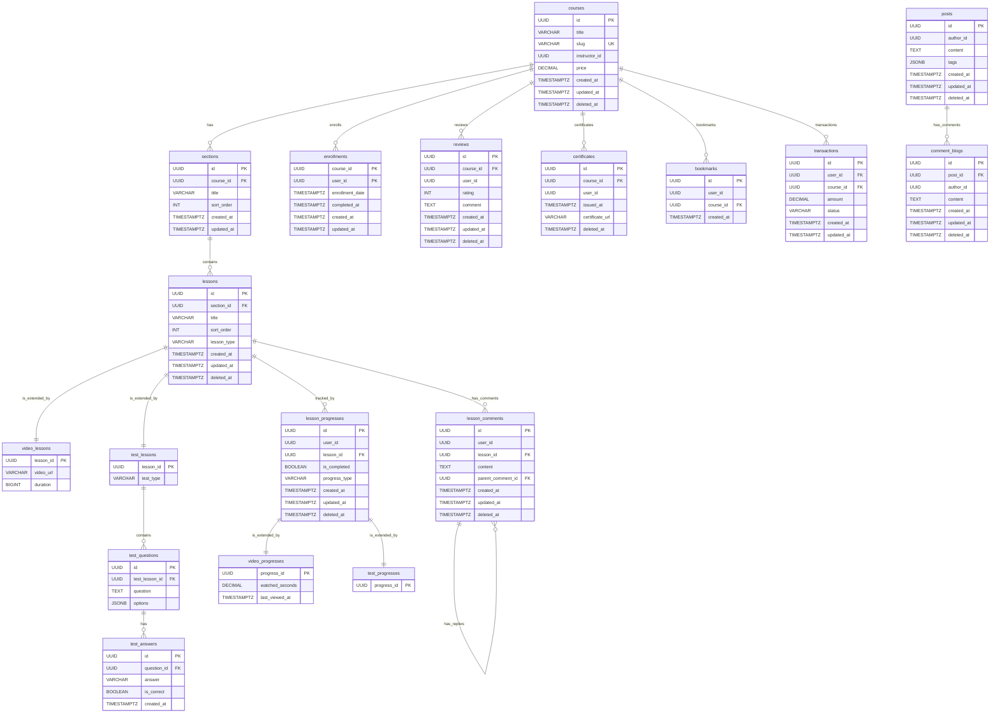

# Database Diagram

:::info

- Only column marked with `N` mean nullable

:::

```mermaid
erDiagram
    courses {
        UUID id PK
        VARCHAR title
        VARCHAR slug UK
        UUID instructor_id
        DECIMAL price
        TIMESTAMPTZ created_at
        TIMESTAMPTZ updated_at
        TIMESTAMPTZ deleted_at
    }

    sections {
        UUID id PK
        UUID course_id FK
        VARCHAR title
        INT sort_order
        TIMESTAMPTZ created_at
        TIMESTAMPTZ updated_at
    }

    lessons {
        UUID id PK
        UUID section_id FK
        VARCHAR title
        INT sort_order
        VARCHAR lesson_type
        TIMESTAMPTZ created_at
        TIMESTAMPTZ updated_at
        TIMESTAMPTZ deleted_at
    }

    video_lessons {
        UUID lesson_id PK
        VARCHAR video_url
        BIGINT duration
    }

    test_lessons {
        UUID lesson_id PK
        VARCHAR test_type
    }

    test_questions {
        UUID id PK
        UUID test_lesson_id FK
        TEXT question
        JSONB options
    }

    test_answers {
        UUID id PK
        UUID question_id FK
        VARCHAR answer
        BOOLEAN is_correct
        TIMESTAMPTZ created_at
    }

    enrollments {
        UUID course_id PK
        UUID user_id   PK
        TIMESTAMPTZ enrollment_date
        TIMESTAMPTZ completed_at
        TIMESTAMPTZ created_at
        TIMESTAMPTZ updated_at
    }

    lesson_progresses {
        UUID id PK
        UUID user_id
        UUID lesson_id FK
        BOOLEAN is_completed
        VARCHAR progress_type
        TIMESTAMPTZ created_at
        TIMESTAMPTZ updated_at
        TIMESTAMPTZ deleted_at
    }

    video_progresses {
        UUID progress_id PK
        DECIMAL watched_seconds
        TIMESTAMPTZ last_viewed_at
    }

    test_progresses {
        UUID progress_id PK
    }

    lesson_comments {
        UUID id PK
        UUID user_id
        UUID lesson_id FK
        TEXT content
        UUID parent_comment_id FK
        TIMESTAMPTZ created_at
        TIMESTAMPTZ updated_at
        TIMESTAMPTZ deleted_at
    }

    reviews {
        UUID id PK
        UUID course_id FK
        UUID user_id
        INT rating
        TEXT comment
        TIMESTAMPTZ created_at
        TIMESTAMPTZ updated_at
        TIMESTAMPTZ deleted_at
    }

    certificates {
        UUID id PK
        UUID course_id FK
        UUID user_id
        TIMESTAMPTZ issued_at
        VARCHAR certificate_url
        TIMESTAMPTZ deleted_at
    }

    bookmarks {
        UUID id PK
        UUID user_id
        UUID course_id FK
        TIMESTAMPTZ created_at
    }

    transactions {
        UUID id PK
        UUID user_id   FK
        UUID course_id FK
        DECIMAL amount
        VARCHAR status
        TIMESTAMPTZ created_at
        TIMESTAMPTZ updated_at
    }

    posts {
        UUID id PK
        UUID author_id
        TEXT content
        JSONB tags
        TIMESTAMPTZ created_at
        TIMESTAMPTZ updated_at
        TIMESTAMPTZ deleted_at
    }

    comment_blogs {
        UUID id PK
        UUID post_id FK
        UUID author_id
        TEXT content
        TIMESTAMPTZ created_at
        TIMESTAMPTZ updated_at
        TIMESTAMPTZ deleted_at
    }

    courses ||--o{ sections : "has"
    sections ||--o{ lessons : "contains"

    lessons ||--|| video_lessons : "is_extended_by"
    lessons ||--|| test_lessons : "is_extended_by"

    test_lessons ||--o{ test_questions : "contains"
    test_questions ||--o{ test_answers : "has"

    lessons ||--o{ lesson_progresses : "tracked_by"
    lesson_progresses ||--|| video_progresses : "is_extended_by"
    lesson_progresses ||--|| test_progresses : "is_extended_by"

    lessons ||--o{ lesson_comments : "has_comments"
    lesson_comments ||--o{ lesson_comments : "has_replies"

    courses ||--o{ enrollments : "enrolls"
    courses ||--o{ reviews : "reviews"
    courses ||--o{ certificates : "certificates"
    courses ||--o{ bookmarks : "bookmarks"

    posts ||--o{ comment_blogs : "has_comments"

    courses ||--o{ transactions : "transactions"
```