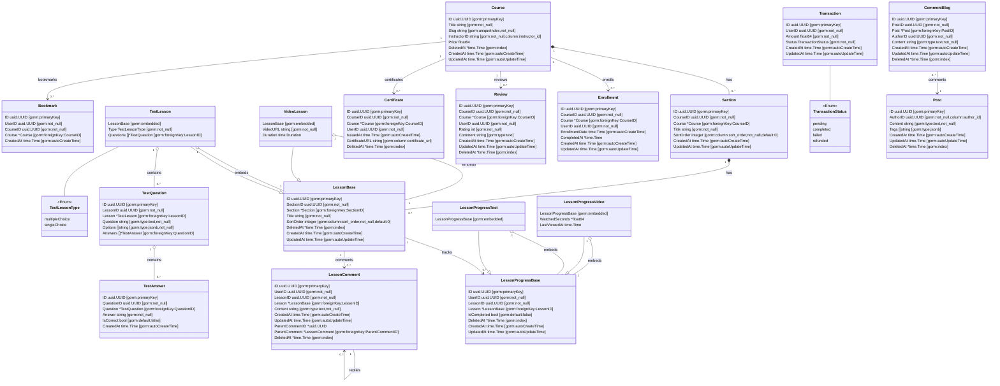

# Entity

## Course

```mermaid
classDiagram
    class Course {
        ID uuid.UUID [gorm:primaryKey]
        Title string [gorm:not_null]
        Slug string [gorm:uniqueIndex,not_null]
        InstructorID string [gorm:not_null,column:instructor_id]
        Price float64
        DeletedAt *time.Time [gorm:index]
        CreatedAt time.Time [gorm:autoCreateTime]
        UpdatedAt time.Time [gorm:autoUpdateTime]
    }

    class Section {
        ID uuid.UUID [gorm:primaryKey]
        CourseID uuid.UUID [gorm:not_null]
        Course *Course [gorm:foreignKey:CourseID]
        Title string [gorm:not_null]
        SortOrder integer [gorm:column:sort_order,not_null,default:0]
        CreatedAt time.Time [gorm:autoCreateTime]
        UpdatedAt time.Time [gorm:autoUpdateTime]
    }

    class LessonBase {
        ID uuid.UUID [gorm:primaryKey]
        SectionID uuid.UUID [gorm:not_null]
        Section *Section [gorm:foreignKey:SectionID]
        Title string [gorm:not_null]
        SortOrder integer [gorm:column:sort_order,not_null,default:0]
        DeletedAt *time.Time [gorm:index]
        CreatedAt time.Time [gorm:autoCreateTime]
        UpdatedAt time.Time [gorm:autoUpdateTime]
    }

    class TestLessonType {
        <<Enum>>
        multipleChoice
        singleChoice
    }

    class TestLesson {
        LessonBase [gorm:embedded]
        Type TestLessonType [gorm:not_null]
        Questions []*TestQuestion [gorm:foreignKey:LessonID]
    }

    class TestQuestion {
        ID uuid.UUID [gorm:primaryKey]
        LessonID uuid.UUID [gorm:not_null]
        Lesson *TestLesson [gorm:foreignKey:LessonID]
        Question string [gorm:type:text,not_null]
        Options []string [gorm:type:jsonb,not_null]
        Answers []*TestAnswer [gorm:foreignKey:QuestionID]
    }

    class TestAnswer {
        ID uuid.UUID [gorm:primaryKey]
        QuestionID uuid.UUID [gorm:not_null]
        Question *TestQuestion [gorm:foreignKey:QuestionID]
        Answer string [gorm:not_null]
        IsCorrect bool [gorm:default:false]
        CreatedAt time.Time [gorm:autoCreateTime]
    }

    class VideoLesson {
        LessonBase [gorm:embedded]
        VideoURL string [gorm:not_null]
        Duration time.Duration
    }

    class Enrollment {
        ID uuid.UUID [gorm:primaryKey]
        CourseID uuid.UUID [gorm:not_null]
        Course *Course [gorm:foreignKey:CourseID]
        UserID uuid.UUID [gorm:not_null]
        EnrollmentDate time.Time [gorm:autoCreateTime]
        CompletedAt *time.Time
        CreatedAt time.Time [gorm:autoCreateTime]
        UpdatedAt time.Time [gorm:autoUpdateTime]
    }

    class LessonProgressBase {
        ID uuid.UUID [gorm:primaryKey]
        UserID uuid.UUID [gorm:not_null]
        LessonID uuid.UUID [gorm:not_null]
        Lesson *LessonBase [gorm:foreignKey:LessonID]
        IsCompleted bool [gorm:default:false]
        DeletedAt *time.Time [gorm:index]
        CreatedAt time.Time [gorm:autoCreateTime]
        UpdatedAt time.Time [gorm:autoUpdateTime]
    }

    class LessonProgressTest {
        LessonProgressBase [gorm:embedded]
    }

    class LessonProgressVideo {
        LessonProgressBase [gorm:embedded]
        WatchedSeconds *float64
        LastViewedAt time.Time
    }

    class LessonComment {
        ID uuid.UUID [gorm:primaryKey]
        UserID uuid.UUID [gorm:not_null]
        LessonID uuid.UUID [gorm:not_null]
        Lesson *LessonBase [gorm:foreignKey:LessonID]
        Content string [gorm:type:text,not_null]
        CreatedAt time.Time [gorm:autoCreateTime]
        UpdatedAt time.Time [gorm:autoUpdateTime]
        ParentCommentID *uuid.UUID
        ParentComment *LessonComment [gorm:foreignKey:ParentCommentID]
        DeletedAt *time.Time [gorm:index]
    }

    class Review {
        ID uuid.UUID [gorm:primaryKey]
        CourseID uuid.UUID [gorm:not_null]
        Course *Course [gorm:foreignKey:CourseID]
        UserID uuid.UUID [gorm:not_null]
        Rating int [gorm:not_null]
        Comment string [gorm:type:text]
        CreatedAt time.Time [gorm:autoCreateTime]
        UpdatedAt time.Time [gorm:autoUpdateTime]
        DeletedAt *time.Time [gorm:index]
    }

    class Certificate {
        ID uuid.UUID [gorm:primaryKey]
        CourseID uuid.UUID [gorm:not_null]
        Course *Course [gorm:foreignKey:CourseID]
        UserID uuid.UUID [gorm:not_null]
        IssuedAt time.Time [gorm:autoCreateTime]
        CertificateURL string [gorm:column:certificate_url]
        DeletedAt *time.Time [gorm:index]
    }

    class Bookmark {
        ID uuid.UUID [gorm:primaryKey]
        UserID uuid.UUID [gorm:not_null]
        CourseID uuid.UUID [gorm:not_null]
        Course *Course [gorm:foreignKey:CourseID]
        CreatedAt time.Time [gorm:autoCreateTime]
    }

    class TransactionStatus {
        <<Enum>>
        pending
        completed
        failed
        refunded
    }

    class Transaction {
        ID uuid.UUID [gorm:primaryKey]
        UserID uuid.UUID [gorm:not_null]
        Amount float64 [gorm:not_null]
        Status TransactionStatus [gorm:not_null]
        CreatedAt time.Time [gorm:autoCreateTime]
        UpdatedAt time.Time [gorm:autoUpdateTime]
    }

    %% Blog Entities - THÊM MỚI
    class Post {
        ID uuid.UUID [gorm:primaryKey]
        AuthorID uuid.UUID [gorm:not_null,column:author_id]
        Content string [gorm:type:text,not_null]
        Tags []string [gorm:type:jsonb]
        CreatedAt time.Time [gorm:autoCreateTime]
        UpdatedAt time.Time [gorm:autoUpdateTime]
        DeletedAt *time.Time [gorm:index]
    }

    class CommentBlog {
        ID uuid.UUID [gorm:primaryKey]
        PostID uuid.UUID [gorm:not_null]
        Post *Post [gorm:foreignKey:PostID]
        AuthorID uuid.UUID [gorm:not_null]
        Content string [gorm:type:text,not_null]
        CreatedAt time.Time [gorm:autoCreateTime]
        UpdatedAt time.Time [gorm:autoUpdateTime]
        DeletedAt *time.Time [gorm:index]
    }

    %% Relationships - COURSE
    Course "1" *-- "0..*" Section : has
    Section "1" *-- "0..*" LessonBase : has

    %% Relationships - LESSONS
    TestLesson "1" o-- "1" LessonBase : embeds
    VideoLesson "1" o-- "1" LessonBase : embeds
    TestLesson --|> LessonBase
    VideoLesson --|> LessonBase

    %% Relationships - TEST
    TestLesson "1" o-- "0..*" TestQuestion : contains
    TestQuestion "1" o-- "0..*" TestAnswer : contains
    TestLesson -- TestLessonType

    %% Relationships - PROGRESS
    LessonProgressTest "1" o-- "1" LessonProgressBase : embeds
    LessonProgressVideo "1" o-- "1" LessonProgressBase : embeds
    LessonProgressTest --|> LessonProgressBase
    LessonProgressVideo --|> LessonProgressBase

    %% Relationships - COURSE INTERACTIONS
    Course "1" --> "0..*" Enrollment : enrolls
    Course "1" --> "0..*" Review : reviews
    Course "1" --> "0..*" Certificate : certificates
    Course "1" --> "0..*" Bookmark : bookmarks

    %% Relationships - LESSON INTERACTIONS
    LessonBase "1" --> "0..*" LessonProgressBase : tracks
    LessonBase "1" --> "0..*" LessonComment : comments
    LessonComment "1" --> "0..*" LessonComment : replies

    %% Relationships - BILLING
    Transaction -- TransactionStatus

    %% Relationships - BLOG
    CommentBlog "0..*" --> "1" Post : comments
```

<!-- vim:set tabstop=4 shiftwidth=4: -->
