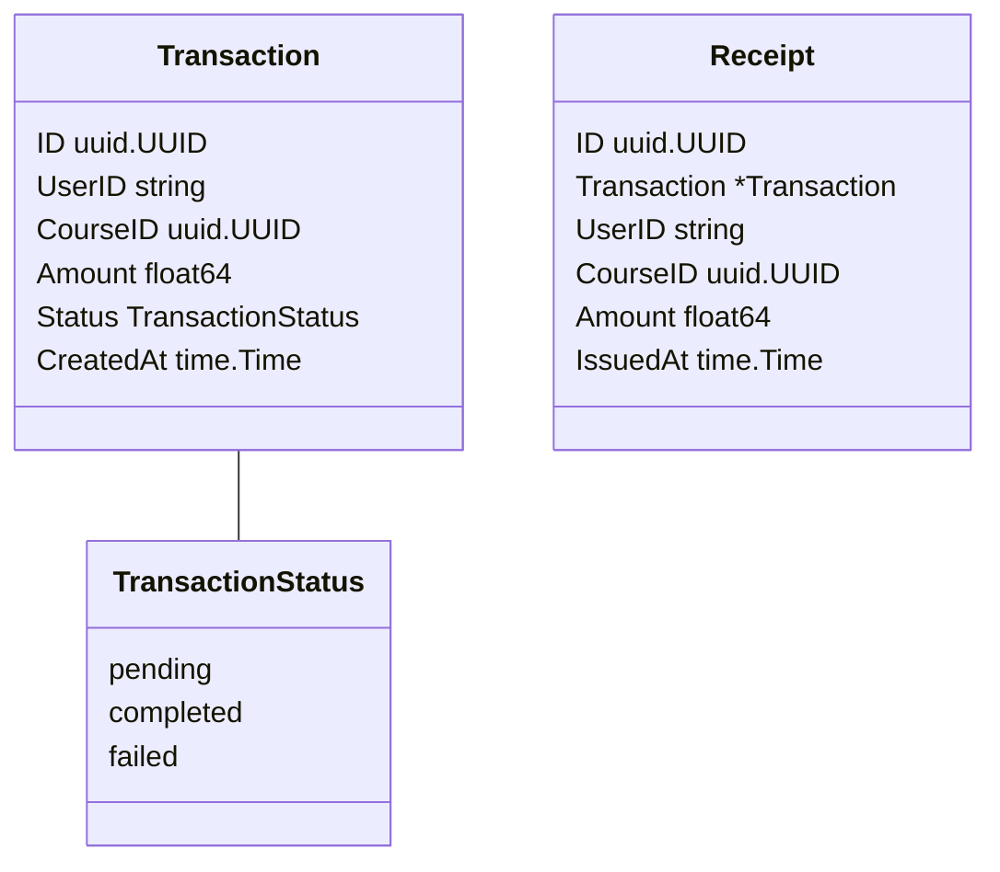
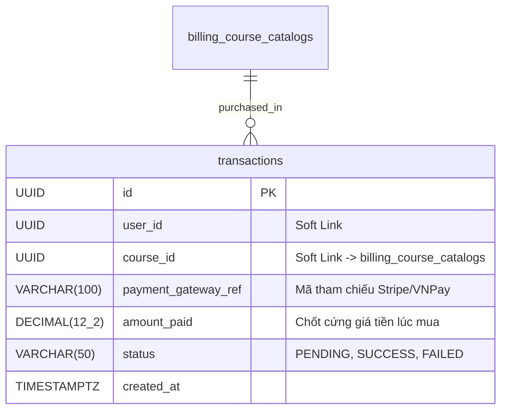

# Billing

## Class Diagram

```mermaid
classDiagram
    class TransactionStatus {
        pending
        completed
        failed
    }

    class Transaction {
        ID uuid.UUID
        UserID string
        CourseID uuid.UUID
        Amount float64
        Status TransactionStatus
        CreatedAt time.Time
    }

    class Receipt {
        ID uuid.UUID
        Transaction *Transaction
        UserID string
        CourseID uuid.UUID
        Amount float64
        IssuedAt time.Time
    }

    Transaction -- TransactionStatus
```

## Database

```mermaid
erDiagram
    transactions {
        UUID id PK
        UUID user_id "Soft Link"
        UUID course_id "Soft Link -> billing_course_catalogs"
        VARCHAR(100) payment_gateway_ref "Mã tham chiếu Stripe/VNPay"
        DECIMAL(12_2) amount_paid "Chốt cứng giá tiền lúc mua"
        VARCHAR(50) status "PENDING, SUCCESS, FAILED"
        TIMESTAMPTZ created_at
    }

    billing_course_catalogs ||--o{ transactions : "purchased_in"
```

<!-- vim:set tabstop=4 shiftwidth=4: -->
